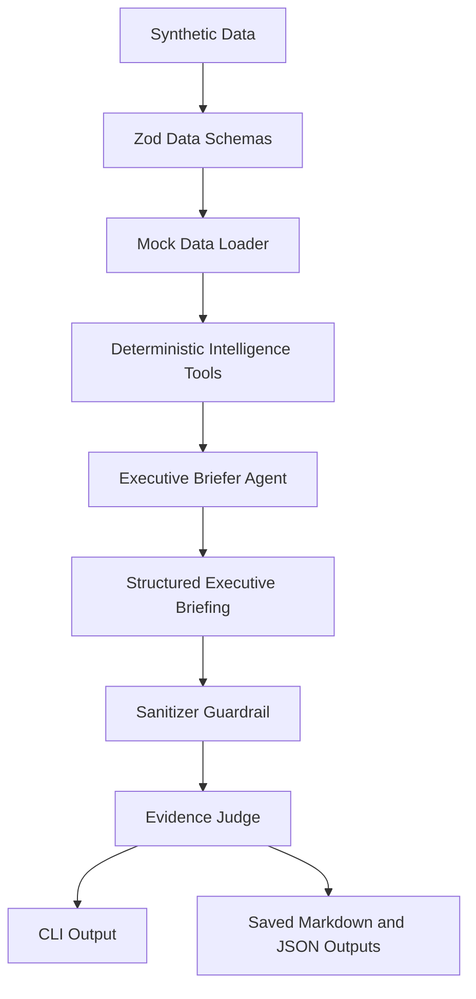

# SignalForge War Room Architecture

SignalForge War Room is a CLI-first, API-ready multi-agent business intelligence demo system.

It simulates how a DappRadar-like company could use AI agents to monitor market signals, account activity, competitor movement, support/product risk, and executive decision workflows using only synthetic and public-style data.

## Core Design



## Main Layers

### 1. Synthetic Data Layer

Location:

- `data/mock/accounts.json`
- `data/mock/competitors.json`
- `data/mock/market_signals.json`
- `data/mock/support_tickets.json`
- `data/mock/product_metrics.json`

All datasets are synthetic. They are designed to look like realistic internal business intelligence inputs without using private company data.

### 2. Schema Layer

Location:

- `src/schemas/data.ts`
- `src/schemas/tools.ts`
- `src/schemas/briefing.ts`
- `src/schemas/judge.ts`

Zod schemas validate data, tool outputs, AI briefing outputs, and judge results.

### 3. Data Loader Layer

Location:

- `src/db/mock-data.ts`

The loader reads local mock JSON files and validates them before any tool or agent uses the data.

### 4. Deterministic Tools Layer

Location:

- `src/tools/`

Tools convert raw mock data into business intelligence snapshots:

- account intelligence snapshots
- competitor watch snapshots
- war room signal digests
- support risk summaries

### 5. AI Agent Layer

Location:

- `src/agents/executive-briefer.ts`

The Executive Briefer Agent receives deterministic tool outputs and generates a structured executive briefing through OpenAI Structured Outputs.

### 6. Guardrail and Judge Layer

Location:

- `src/agents/evidence-judge.ts`

The Evidence Judge verifies:

- executive summary quality
- evidence references
- recommended actions
- separated assumptions
- absence of private-data language

### 7. Output Persistence Layer

Location:

- `src/output/briefing-writer.ts`

Generated briefings and judge reports are saved locally as Markdown and JSON.

## CLI Commands

```bash
pnpm sf health
pnpm sf data:check
pnpm sf tools:demo
pnpm sf briefing:demo
pnpm sf briefing:judge
```

## Data Policy

This repo uses only:

- synthetic internal-style data
- public-source-inspired summaries
- mock customer/account/competitor/product/support datasets

It does not use:

- private DappRadar code
- private DappRadar data
- private APIs
- confidential workflows
- real customer data